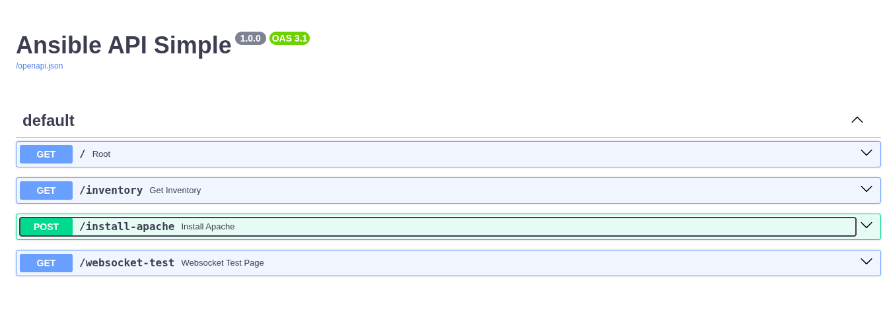
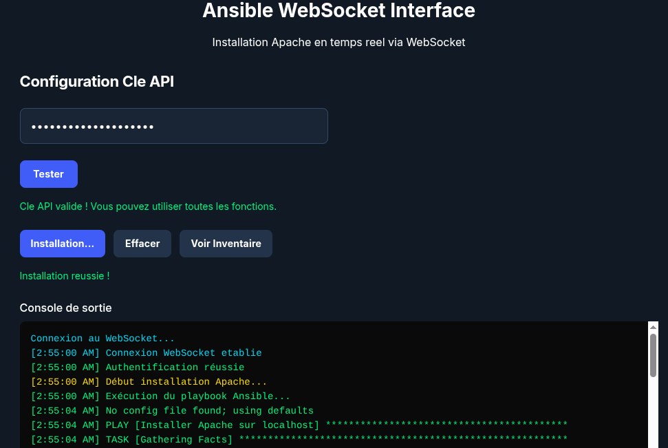

# Construction d'une API REST avec FastAPI pour contrôler Ansible

## 1. Objectifs pédagogiques

À l'issue de cette doc, vous serez capable de :
• Mettre en place un environnement Python isolé destiné au développement d'une API REST.
• Utiliser FastAPI pour exposer des endpoints HTTP asynchrones.
• Piloter des playbooks Ansible au travers d'un service web.
• Sécuriser une API (authentification par clé d'API).
• Tester l'API.

## 2. Prérequis

• Python ≥ 3.11 installé sur la machine (ou utilisation d'un conteneur Docker).
• Accès réseau permettant l'installation de packages depuis PyPI.
• Ansible et ansible-runner (ou ansible-core) installés.
• Connaissances de base en HTTP et en ligne de commande (curl/httpie).

## 3. Contexte du TP

Vous êtes responsable d'automatiser la gestion d'une ferme de serveurs via Ansible. Pour des besoins d'intégration dans un portail interne, vous devez exposer certaines actions Ansible (exécution de playbooks, interrogation d'inventaires) au travers d'une API REST que pourra consommer le portail.

## 4. Installation et configuration

### 4.1. Cloner le projet
```bash
git clone <votre-repo>
cd ansible-websocket-interface
```

### 4.2. Créer l'environnement virtuel
```bash
python -m venv venv
source venv/bin/activate  # Linux/Mac
# ou
venv\Scripts\activate     # Windows
```

### 4.3. Installer les dépendances
```bash
pip install -r requirements.txt
```

### 4.4. Lancer l'application
```bash
python main.py
```

### 4.5. Accéder à l'interface
- Interface WebSocket : `http://localhost:8000/interface`
- API REST Swagger : `http://localhost:8000/docs`
- API REST Redoc : `http://localhost:8000/redoc`

## 5. Utilisation et tests

### 5.1. Interface WebSocket (Recommandée)
1. Ouvrir `http://localhost:8000/interface`
2. Cliquer sur "Installer Apache"
3. Voir l'exécution en temps réel

### 5.2. API REST
- Documentation interactive : `http://localhost:8000/docs`
- Endpoints disponibles :
  - `GET /` - Page d'accueil
  - `GET /interface` - Interface WebSocket
  - `GET /inventory` - Inventaire Ansible
  - `POST /install-apache` - Installation Apache
  - `WebSocket /ws/install-apache` - Exécution temps réel



### 5.3. Tests via interface web
```bash
# Lancer le serveur
python3 main.py

# Ouvrir dans le navigateur
http://localhost:8000/interface
```

### 5.4. Tests via API REST
```bash
# Vérifier l'API
curl http://localhost:8000/

# Installer Apache
curl -X POST http://localhost:8000/install-apache
```

## 6. Structure du projet
```
ansible-websocket-interface/
├── main.py                    # Application FastAPI principale
├── requirements.txt           # Dépendances Python
├── README.md                  # Documentation
├── venv/                      # Environnement virtuel
├── static/
│   └── websocket-interface.html  # Interface web
└── ansible/
    ├── inventory.yml          # Inventaire des serveurs
    └── playbooks/
        └── install-apache.yml # Playbook d'installation Apache
```

## 7. Technologies utilisées

- **FastAPI** - Framework web moderne pour Python
- **WebSocket** - Communication bidirectionnelle temps réel
- **Ansible** - Automatisation et orchestration d'infrastructure
- **ansible-runner** - Exécution programmatique d'Ansible
- **HTML/CSS/JavaScript** - Interface utilisateur web
- **Python 3.11+** - Langage de programmation principal

## 8. WebSocket

• Ajout de la prise en charge de WebSocket pour le suivi temps réel de l'exécution des playbooks.


